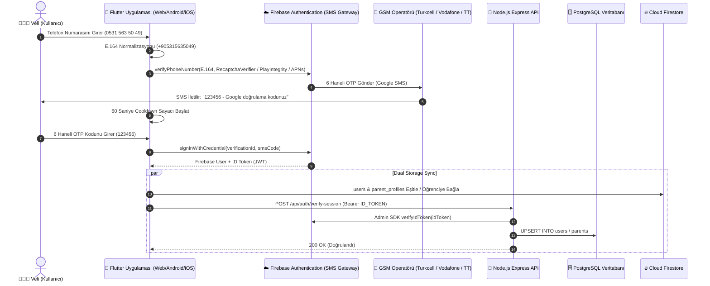
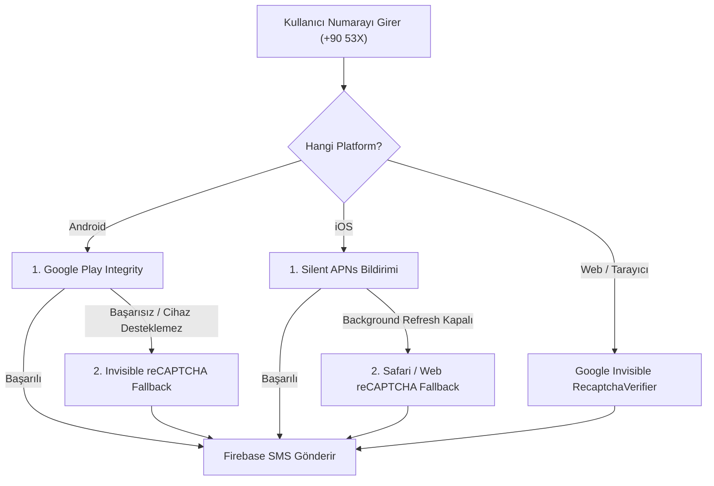
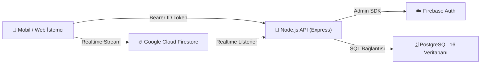

# 📱 Firebase Telefon Doğrulama (SMS OTP) — Mimari ve Sistem Tasarımı

**Proje:** MatPusula — Ödev & Sınav Takip Sistemi  
**Tarih:** 21 Ağustos 2026  
**Durum:** Üretim Seviyesi (Production-Ready)

---

## 1. 🌟 Yönetici Özeti & Temel İlke

> ⚠️ **Üretim Kuralı:**  
> SMS doğrulama kodunu (OTP) asla kendi backend'inizde üretmeyin, saklamayın veya doğrulamayın!  
> Firebase Authentication, SMS gönderimi, OTP doğrulaması ve oturum yönetiminin **tek yetkili kaynağı (Single Source of Truth)** olmalıdır.  
> Kullanıcı Firebase ile başarıyla giriş yaptıktan sonra istemci **Firebase ID Token** alır ve bunu backend'e iletir. Backend ise **Firebase Admin SDK** ile bu token'ı doğrular.

---

## 2. 🔄 Uçtan Uca Telefon Doğrulama Akış Şeması (Sequence Diagram)

---

## 3. 🛡️ Platform Bazlı Uygulama Doğrulama (App Verification Fallbacks)

---

## 4. 🗄️ Hibrit Çift Veritabanı Mimarisi (Firestore + PostgreSQL)

1. **Firebase Firestore:**
   * Anlık mobil ve web arayüzü akışı, canlı deneme net grafikleri (`fl_chart`), ödev bildirimleri.
2. **PostgreSQL 16:**
   * Kurumsal ilişkisel veri yapısı, SQL analitiği, muhasebe/raporlama ve kalıcı yedekleme.
