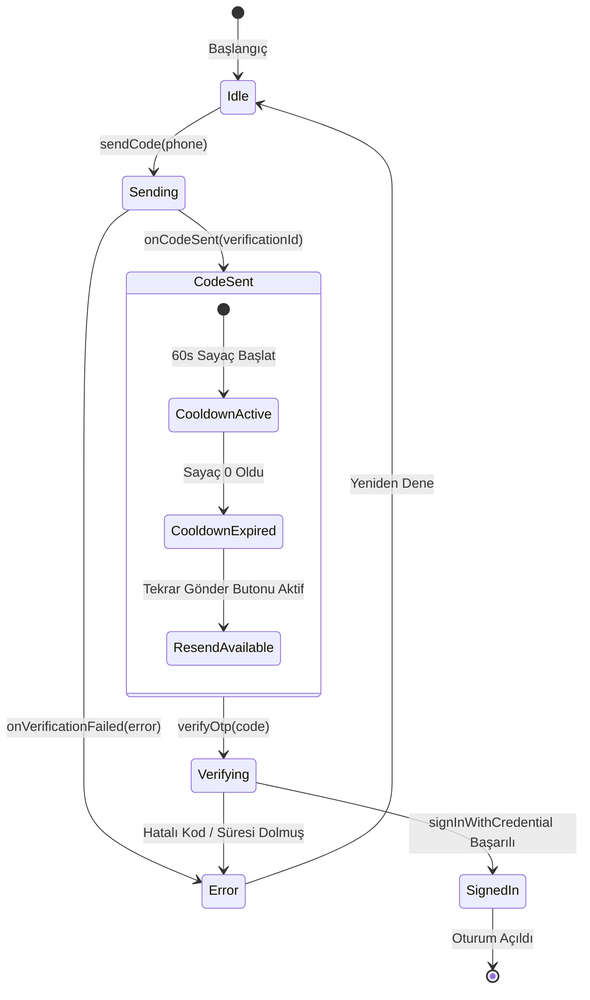

# 🛡️ Firebase Phone Auth — Güvenlik, Hız Sınırlaması & Tehdit Modeli

**Proje:** MatPusula  
**Standart:** Üretim Seviyesi Güvenlik Kılavuzu

---

## 1. 🎯 Tehdit Modeli & Alınan Önlemler

| Tehdit Türü | Risk Açıklaması | MatPusula Güvenlik Önlemi |
|---|---|---|
| 🚨 **SMS Pumping / Toll Fraud** | Saldırganların pahalı uluslararası numaralara botlarla milyonlarca SMS tetikleyerek maliyet çıkarması | **SMS Region Allowlist:** Yalnızca Türkiye (+90) ve belirlenen ülkeler açık. Diğer 200+ ülke varsayılan olarak bloke edilir. |
| 🤖 **Bot & Otomasyon Saldırıları** | Otomatik scriptlerle kayıt ve doğrulama denemeleri | **App Verification:** Android'de Play Integrity, iOS'ta APNs, Web'de Google Invisible reCAPTCHA v3/v2 kullanılır. |
| ⏱️ **Kullanıcı Resend Abuse** | Kullanıcının butona art arda basarak SMS kotalarını tüketmesi | **60s UX Cooldown:** Kod gönderildikten sonra buton kilitlenir ve 60 saniyelik geri sayım başlar. |
| 🔑 **ID Token Sahteciliği** | İstemcinin rastgele bir telefon numarası veya UID ile backend'i kandırmaya çalışması | **Firebase Admin SDK:** Backend, istemcinin beyan ettiği bilgileri değil, kriptografik imzalı `Bearer <ID_TOKEN>` doğrular. |
| 👁️ **Hassas Veri Sızıntısı (PII)** | Telefon ve token'ların loglara açık şekilde yazılması | **Data Sanitization:** Ham telefon numaraları `+90 531 *** ** 49` şeklinde maskelenir. OTP ve Token'lar hiçbir zaman loglanmaz. |

---

## 2. 🚦 60 Saniye Cooldown & Durum Makinesi (State Machine)



---

## 3. 🔐 Backend Token Doğrulama Güvenlik Kuralı

```javascript
// src/middleware/authMiddleware.js
const decodedToken = await admin.auth().verifyIdToken(idToken);
// req.user.uid ve req.user.phone_number Google tarafından onaylanmış güvenilir veridir.
```
