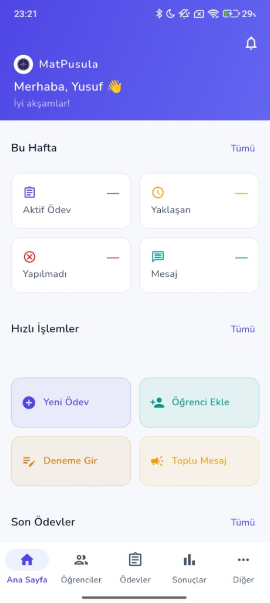
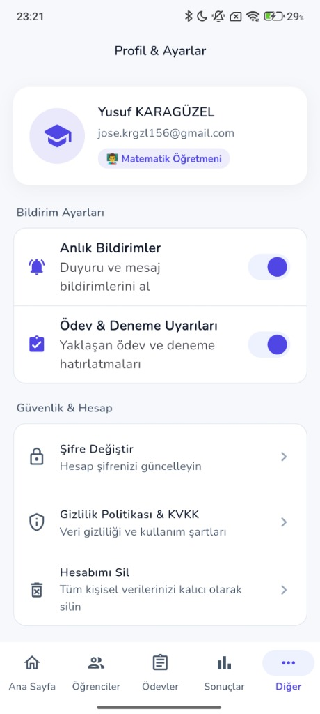

<div align="center">

  

  # 🧭 MatPusula — Ödev & Deneme Sınavı Takip Platformu

  **Modern, Hızlı ve Güvenli Öğretmen & Veli İletişim Portalı**

  [](https://flutter.dev)
  [](https://firebase.google.com)
  [](https://nodejs.org)
  [](https://www.postgresql.org)
  [](#-test-ve-kalite-raporu)

</div>

---

## 📱 Gerçek Uygulama Ekran Görüntüleri (Authentic Mobile Screenshots)

<div align="center">
  
  
  
</div>

<br/>

| 🏠 Ana Sayfa & Kontrol Paneli | 📚 Ödev Yönetim Modülü | 👤 Profil & Hesap Ayarları |
|---|---|---|
| Öğretmen kar karşılama, haftalık istatistikler, hızlı işlemler | Konu/ders bazlı ödev listeleri, son teslim tarihleri, ekleme & silme | Profil bilgileri, anlık bildirim tercihleri, KVKK ve kalıcı hesap silme |

---

## ✨ Öne Çıkan Özellikler

### 👨‍🏫 Öğretmen Modülü
* **Sınıf & Öğrenci Yönetimi:** Kolay sınıf oluşturma, seviye filtresi, öğrenci ekleme ve profil detayları.
* **6 Haneli Veli Davet Kodu:** Her öğrenciye özel otomatik son kullanma tarihli (`OT-XXXXXX`) eşleşme kodu üretme ve panoya kopyalama (`Clipboard`).
* **Ödev Takip Paneli:** Sınıfa veya tekli öğrenciye ödev tanımlama; *Tamamlandı*, *Yapılmadı*, *Bekliyor* durum yönetimi.
* **Deneme Sınavı & Net Hesabı:** Ders bazlı Doğru/Yanlış girdileri ile otomatik net hesabı (4 Yanlış = 1 Doğru) ve **`fl_chart`** başarı grafiği.
* **Duyuru & Mesajlaşma:** Sınıf velilerine anlık toplu duyuru ve bildirim iletimi.

### 👨‍👩‍👧‍👦 Veli Modülü
* **Davet Koduyla Hızlı Kayıt:** Öğretmenden alınan 6 haneli kod ile saniyeler içinde öğrenciye otomatik bağlanma.
* **Beni Hatırla (Kalıcı Oturum):** Çıkış yapılana kadar tek tıkla otomatik giriş kalıcılığı.
* **Öğrenci Durum Takibi:** Çocuğun ödev durumlarını, deneme net grafiklerini ve öğretmen notlarını anlık görüntüleme.
* **Mesaj Kutusu:** Öğretmenden gelen duyuruları görüntüleme ve okundu durum takibi.

---

## 🏗️ Proje Mimarisi

```text
lib/
├── app/                  # GoRouter yönlendirme ve RoleGuard güvenlik duvarı
├── core/                 # Tema, renkler, boyutlar, ortak widget'lar ve uzantılar
└── features/
    ├── analytics/        # fl_chart grafikleri ve hedef net analizleri
    ├── auth/             # Firebase Auth, login/register wizard, rollback ve kalıcı silme
    ├── classes/          # Sınıf listesi ve detay ekranları
    ├── dashboard/        # Öğretmen & Veli ana panelleri
    ├── exams/            # Deneme sınavı sonuçları ve net hesaplayıcı
    ├── homeworks/        # Ödev atama ve kontrol listesi
    ├── messages/         # Veli duyuru ve mesajlaşma servisleri
    ├── profile/          # Profil, KVKK Gizlilik bildirimi ve hesap silme
    └── students/         # Öğrenci profilleri ve davet kodu jeneratörü
```

---

## 🐘 Backend & Senkronizasyon Servisi (`backend/`)

Uygulama, Google Firebase verilerinin yerel PostgreSQL veritabanına otomatik senkronize edilmesini sağlayan **Node.js Express + Docker** servisine sahiptir.

* **Dokümantasyon & API:** Node.js Express REST API (`/api/health`, `/api/data/students`, `/api/data/exam-results`)
* **Veritabanı:** PostgreSQL 16 Alpine + pgAdmin 4 Container'ları (`docker-compose.yml`)
* **Testler:** Jest REST API entegrasyon testleri (`7/7 Passed`)

---

## 🧪 Test ve Kalite Raporu

```bash
# Flutter Birim & Widget Testlerini Çalıştır
flutter test

# Backend REST API Entegrasyon Testlerini Çalıştır
cd backend && npm test
```

| Test Paketi | Test Sayısı | Başarı Oranı |
|---|---|---|
| **Flutter Unit & Widget Tests** | 27 / 27 | **%100 PASSED** |
| **Node.js REST API Tests** | 7 / 7 | **%100 PASSED** |
| **Toplam Sistem Testi** | **34 / 34** | **%100 PASSED** |

---

## 🌳 Okul ➔ Sınıf ➔ Öğretmen ➔ Öğrenci ➔ Veli "Soy Ağacı" Hiyerarşisi (Gelecek Yol Haritası / Roadmap)

Sistemin ilişkisel haritasını doğrudan mobil ve yönetim katmanında görselleştirmek için geliştirilecek **Hiyerarşik Soy Ağacı Modülü** planlanmıştır:

- [ ] **Okul & Sınıf Kök Düğümleri (Root Nodes):** Okul altındaki tüm 7. ve 8. sınıf branşlarının listelenmesi.
- [ ] **Öğretmen - Öğrenci Dallanması (Branching):** Her öğretmenin sorumlu olduğu sınıfların ve öğrencilerin dinamik ağaç kırılımı.
- [ ] **Öğrenci - Veli Yaprak Eşleşmesi (Leaves):** 6 haneli davet koduyla bağlanan velilerin öğrencinin altında görsel olarak listelenmesi.
- [ ] **Anlık SMS & Bildirim Durum Sinyali:** Velilerin yanında Twilio SMS iletim durumlarının (✅ İletildi, ⏳ Bekliyor, ❌ Hata) canlı renkli rozetlerle gösterimi.

---

## 🚀 Çalıştırma Rehberi

### 1. Mobil Uygulamayı Çalıştırma (Flutter)
```bash
# Bağımlılıkları yükle
flutter pub get

# Cihazda veya Emülatörde çalıştır
flutter run
```

### 2. Backend & PostgreSQL Docker Servisini Çalıştırma
```bash
# Docker servislerini başlat
docker compose up -d

# Backend servisini başlat
cd backend
npm install
npm start
```

### 3. Web Kontrol Paneli & "Soy Ağacı" Hiyerarşisini Çalıştırma
```bash
# Web Dashboard klasörüne git
cd web-dashboard

# Bağımlılıkları yükle ve geliştirme sunucusunu başlat
npm install
npm run dev
```
Web paneli **http://localhost:3000** adresinde çalışarak Docker, PostgreSQL, Firebase ve Twilio SMS durumlarını anlık izlemenizi ve Okul ➔ Sınıf ➔ Öğrenci ➔ Veli hiyerarşisini görünür kılar.

---

## 📄 Lisans ve Telif Hakkı

© 2026 **MatPusula**. Tüm hakları saklıdır.
