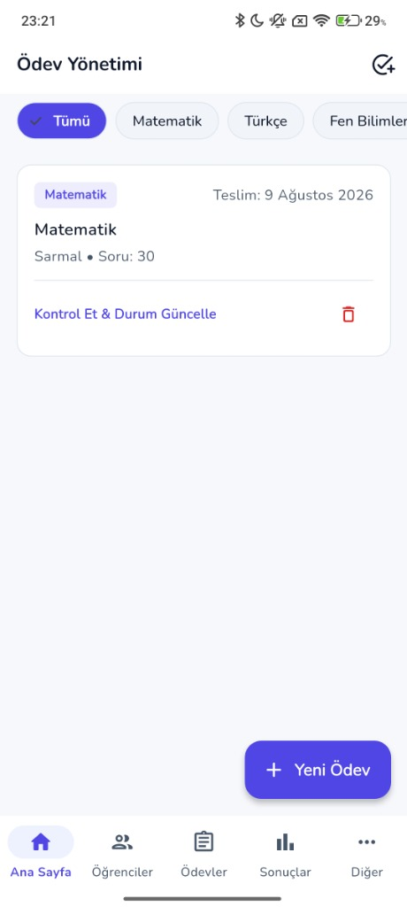

<div align="center">

  

  # 🧭 Eduly — Ödev & Deneme Sınavı Takip Platformu

  **Modern, Hızlı ve Güvenli Öğretmen & Veli İletişim Portalı**

  [](https://flutter.dev)
  [](https://firebase.google.com)
  [](https://nodejs.org)
  [](https://www.postgresql.org)
  [](.github/workflows/ci.yml)

</div>

---

## 📱 Gerçek Uygulama Ekran Görüntüleri (Authentic Mobile Screenshots)

<div align="center">
  
  
  
</div>

<br/>

| 🏠 Ana Sayfa & Kontrol Paneli | 📚 Ödev Yönetim Modülü | 👤 Profil & Hesap Ayarları |
|---|---|---|
| Öğretmen kar karşılama, haftalık istatistikler, hızlı işlemler | Konu/ders bazlı ödev listeleri, son teslim tarihleri, ekleme & silme | Profil bilgileri, anlık bildirim tercihleri, KVKK ve kalıcı hesap silme |

---

## ✨ Öne Çıkan Özellikler

### 👨‍🏫 Öğretmen Modülü
* **Sınıf & Öğrenci Yönetimi:** Kolay sınıf oluşturma, seviye filtresi, öğrenci ekleme ve profil detayları.
* **6 Haneli Veli Davet Kodu:** Her öğrenciye özel otomatik son kullanma tarihli (`OT-XXXXXX`) eşleşme kodu üretme ve panoya kopyalama (`Clipboard`).
* **Ödev Takip Paneli:** Sınıfa veya tekli öğrenciye ödev tanımlama; *Tamamlandı*, *Yapılmadı*, *Bekliyor* durum yönetimi.
* **Deneme Sınavı & Net Hesabı:** Ders bazlı Doğru/Yanlış girdileri ile otomatik net hesabı (4 Yanlış = 1 Doğru) ve **`fl_chart`** başarı grafiği.
* **Duyuru & Mesajlaşma:** Sınıf velilerine anlık toplu duyuru ve bildirim iletimi.

### 👨‍👩‍👧‍👦 Veli Modülü
* **Davet Koduyla Hızlı Kayıt:** Öğretmenden alınan 6 haneli kod ile saniyeler içinde öğrenciye otomatik bağlanma.
* **Beni Hatırla (Kalıcı Oturum):** Çıkış yapılana kadar tek tıkla otomatik giriş kalıcılığı.
* **Öğrenci Durum Takibi:** Çocuğun ödev durumlarını, deneme net grafiklerini ve öğretmen notlarını anlık görüntüleme.
* **Mesaj Kutusu:** Öğretmenden gelen duyuruları görüntüleme ve okundu durum takibi.

---

## 🏗️ Proje Mimarisi

```text
mobile/                   # Flutter iOS/Android uygulaması (öğretmen + veli)
web-panel/                # Flutter web admin paneli (süper kullanıcı gözetimi)
functions/                # Cloud Functions (toplu FCM push: sendBroadcast)
backend/                  # (opsiyonel/legacy) PostgreSQL sync; admin panel buna bağlı değil
```

Admin panel: öğretmen/öğrenci listeleme, platform istatistikleri, aktivite akışı ve filtreli toplu push. **Öğretmen web kopyası değildir.** Manuel admin: [ADMIN_SEED.md](ADMIN_SEED.md). Tasarım handoff + Firebase canlı deploy runbook: [HANDOFF.md](HANDOFF.md).

---

## 🐘 Backend & Senkronizasyon Servisi (`backend/`) — Opsiyonel

Mobil uygulama ve admin panel **doğrudan Firestore** kullanır. `backend/` klasörü, Firebase verilerinin PostgreSQL'e senkronize edilmesi için eski/opsiyonel bir Node.js servisidir; admin panel yol haritasında yer almaz.

---

## 🧪 Test ve Kalite Raporu

```bash
# Flutter Birim & Widget Testlerini Çalıştır
cd mobile && flutter test
cd ../web-panel && flutter test

# Backend REST API Entegrasyon Testlerini Çalıştır
cd backend && npm test
```

| Test Paketi | Test Sayısı | Başarı Oranı |
|---|---|---|
| **Flutter Unit & Widget Tests** (`mobile`) | `flutter test` | CI |
| **Flutter Web Panel** (`web-panel`) | `flutter test` | CI |
| **Node.js REST API Tests** (`backend`) | `npm test` | CI |

Otomatik koşum: [.github/workflows/ci.yml](.github/workflows/ci.yml).

---

## 🌳 Okul ➔ Sınıf ➔ Öğretmen ➔ Öğrenci ➔ Veli "Soy Ağacı" Hiyerarşisi (Gelecek Yol Haritası / Roadmap)

Sistemin ilişkisel haritasını doğrudan mobil ve yönetim katmanında görselleştirmek için geliştirilecek **Hiyerarşik Soy Ağacı Modülü** planlanmıştır:

- [ ] **Okul & Sınıf Kök Düğümleri (Root Nodes):** Okul altındaki tüm 7. ve 8. sınıf branşlarının listelenmesi.
- [ ] **Öğretmen - Öğrenci Dallanması (Branching):** Her öğretmenin sorumlu olduğu sınıfların ve öğrencilerin dinamik ağaç kırılımı.
- [ ] **Öğrenci - Veli Yaprak Eşleşmesi (Leaves):** 6 haneli davet koduyla bağlanan velilerin öğrencinin altında görsel olarak listelenmesi.
- [ ] **Anlık SMS & Bildirim Durum Sinyali:** Velilerin yanında Twilio SMS iletim durumlarının (✅ İletildi, ⏳ Bekliyor, ❌ Hata) canlı renkli rozetlerle gösterimi.

---

## 🚀 Çalıştırma Rehberi

### 1. Mobil Uygulamayı Çalıştırma (Flutter)
```bash
cd mobile
flutter pub get
flutter run
```

### 2. Admin Web Paneli (Flutter Web)

```bash
cd web-panel
flutter pub get
flutter run -d chrome
```

Üretim derlemesi:

```bash
cd web-panel
flutter build web --release
```

Panel yalnızca `role=admin` (+ aktif) hesapları kabul eder. İlk admin: [ADMIN_SEED.md](ADMIN_SEED.md).

Canlı Hosting / rules / functions deploy adımları: **[HANDOFF.md](HANDOFF.md)** (Faz B — Firebase CLI gerekir).

### 3. Backend & PostgreSQL (Opsiyonel)

```bash
docker compose up -d
cd backend && npm install && npm start
```

---

## 📄 Lisans ve Telif Hakkı

© 2026 **Eduly**. Tüm hakları saklıdır.
