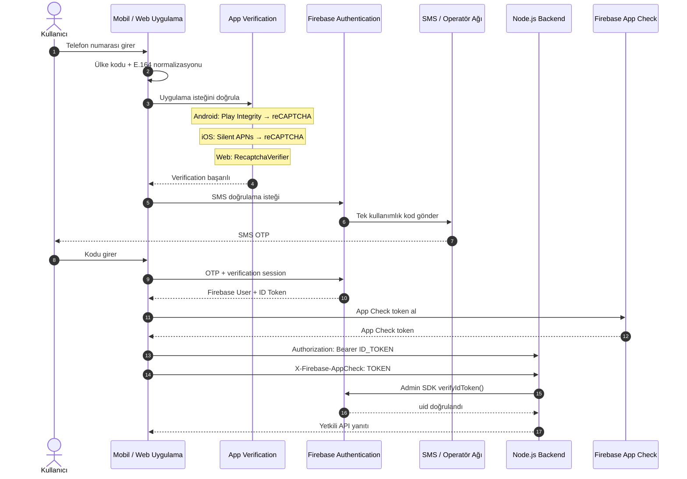
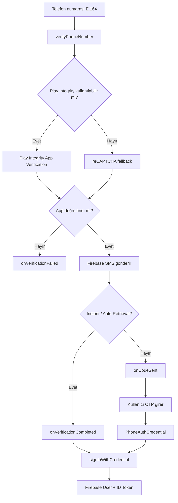
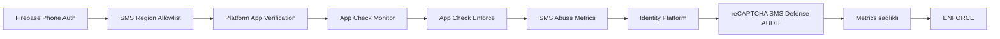
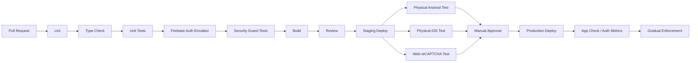
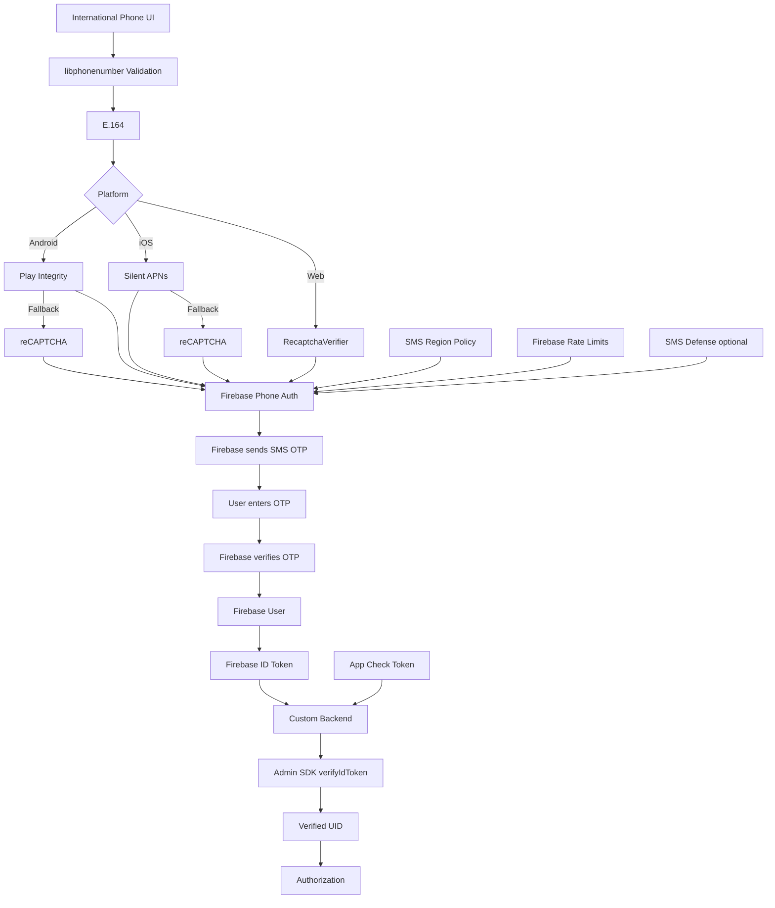

# Firebase Telefon Doğrulama SMS OTP ve ANTIGRAVITY IDE İçin Üretim Rehberi

## Yönetici Özeti

Firebase Authentication ile telefon doğrulama için üretimde önerdiğim mimari şu şekildedir: **SMS kodunu kendi backend'inizde üretmeyin, saklamayın veya doğrulamayın.** Android, iOS ve Web istemcileri Firebase Authentication'ın kendi telefon doğrulama akışını kullanmalı; SMS gönderimi, OTP doğrulaması, doğrulama oturumu ve Firebase kullanıcı oturumunun oluşturulması Firebase tarafından yönetilmelidir. Kullanıcı başarıyla giriş yaptıktan sonra istemci Firebase ID token'ını sizin API'nize gönderir; backend ise Firebase Admin SDK ile bu token'ı doğrular. Firebase'in resmi sunucu mimarisi de istemcide oluşturulan ID token'ın özel backend'e gönderilip Admin SDK ile doğrulanmasını öngörür. citeturn15view0turn17view3

Bu nedenle ANTIGRAVITY IDE'ye vereceğiniz görevde **“bana OTP sistemi yaz”** demek yerine, **“Firebase Phone Authentication'ın resmi native akışlarını kullan, custom OTP üretme, platform app-verification mekanizmalarını eksiksiz kur, Firebase ID token + App Check ile backend'i koru ve tüm edge-case'leri test et”** demek çok daha doğru sonuç verir. Google Antigravity; editör, terminal ve browser üzerinde çalışan ajanlara, plan/artifact üretimine ve değişikliklerin incelenmesine yönelik tasarlandığından, bu görev için promptun sadece kod değil; araştırma, repository analizi, güvenlik incelemesi, test ve doğrulama aşamalarını açıkça tanımlaması gerekir. citeturn17view5turn16view11

En kritik üretim bulguları şunlar:

| Konu | Üretim kararı |
|---|---|
| OTP'nin üretimi ve doğrulanması | Firebase Authentication'a bırakılmalı. İstemci Firebase SDK'yı doğrudan kullanmalı. citeturn15view2turn15view7turn15view12 |
| Backend kimlik doğrulaması | OTP veya telefon numarası yerine Firebase ID token doğrulanmalı. citeturn17view3 |
| Android bot/app doğrulaması | Öncelikle Play Integrity; kullanılamazsa reCAPTCHA fallback. SHA-256 ve fallback için SHA-1 yapılandırılmalı. citeturn17view0 |
| iOS doğrulaması | Silent APNs; başarısız veya kullanılamazsa reCAPTCHA. APNs anahtarı, Push Notifications ve Background Modes doğru yapılandırılmalı. citeturn17view1 |
| Web doğrulaması | `RecaptchaVerifier` zorunlu; domain Firebase Authentication altında authorize edilmeli. citeturn15view10turn15view11 |
| Uluslararası numaralar | UI'da ülke kodu seçilmeli ve numara Firebase'e E.164 biçiminde gönderilmeli. Google'ın libphonenumber kütüphanesi uluslararası parse/format/validation için uygun temel araçtır. citeturn17view4turn16view6 |
| SMS abuse | SMS region allowlist, Firebase kotaları, App Check ve gerekli projelerde Identity Platform reCAPTCHA SMS Defense kullanılmalı. citeturn15view15turn14view7turn14view8 |
| Test | Auth Emulator + Firebase fictional phone numbers + fiziksel cihaz testleri birlikte kullanılmalı. Emulator reCAPTCHA/APNs akışlarını simüle etmez. citeturn14view9turn15view9 |
| Güvenlik seviyesi | Telefon numarası tek başına güçlü bir kimlik faktörü değildir; hassas işlemlerde daha güçlü yöntemlerle desteklenmelidir. citeturn15view1turn15view10 |

**“Sorun çıkarmayacak Firebase telefon doğrulama sistemi” teknik olarak yüzde yüz garanti edilemez.** SMS operatör gecikmeleri, SIM-swap/numara devri, kota ve throttling, Play Integrity/APNs/reCAPTCHA yapılandırması, ülke politikaları ve son kullanıcı cihazları sistemin dış etkenleridir. Firebase'in kendi belgeleri de telefon numarasına dayalı kimlik doğrulamayı diğer bazı yöntemlerden daha düşük güvenlikli olarak tanımlıyor ve Android'de otomatik SMS algılamasının bazı operatörlerde bulunmayabileceğini belirtiyor. citeturn15view1turn15view4

Buna rağmen aşağıdaki mimari, **Firebase Phone Auth için benim üretime alacağım temel mimaridir**.

## Mimari, Akış ve Platform Farkları

### Önerilen mimari

Telefon numarası + SMS OTP akışında backend'in SMS gönderen ara katman haline getirilmesine gerek yoktur. Android'de `PhoneAuthProvider.verifyPhoneNumber`, iOS'ta `PhoneAuthProvider.provider().verifyPhoneNumber`, Web'de ise `signInWithPhoneNumber` doğrudan Firebase Authentication ile konuşur. Doğrulama tamamlanınca Firebase kullanıcı oturumu ve ID token oluşur; custom backend bundan sonra devreye girer. citeturn15view2turn15view7turn15view12turn17view3



Bu ayrım güvenlik açısından önemlidir: **Firebase Auth kullanıcının kimliğini**, **App Check ise isteğin sizin gerçek uygulamanız/uygun istemcinizden gelip gelmediğine dair attestation sinyalini** sağlar. Firebase bunları birbirini tamamlayan güvenlik katmanları olarak tanımlar; App Check tek başına bütün kötüye kullanım türlerini ortadan kaldırmaz. citeturn18view6

### Platform karşılaştırması

| Özellik | Android Kotlin | iOS Swift | Web JS/TS |
|---|---|---|---|
| SMS başlatma | `PhoneAuthProvider.verifyPhoneNumber()` citeturn15view2 | `PhoneAuthProvider.provider().verifyPhoneNumber()` citeturn15view7 | `signInWithPhoneNumber()` citeturn15view12 |
| Birincil app verification | Play Integrity citeturn17view0 | Silent APNs citeturn17view1 | reCAPTCHA citeturn15view11 |
| Fallback | reCAPTCHA | reCAPTCHA | reCAPTCHA zaten ana mekanizma |
| Firebase console sertifika ihtiyacı | SHA-256 Play Integrity; reCAPTCHA fallback için SHA-1 citeturn17view0 | APNs authentication key/certificate + app URL scheme citeturn17view1 | Authorized Domains citeturn15view10 |
| Otomatik doğrulama | Bazı cihazlarda instant verification / SMS auto-retrieval olabilir. citeturn15view3turn15view4 | Sessiz APNs istemci uygulamasının doğrulanması içindir; kullanıcı yine OTP akışını tamamlar. citeturn17view1 | Kod `ConfirmationResult.confirm(code)` ile doğrulanır. citeturn15view13 |
| Lifecycle durumu | `verificationId` ve resend token korunmalı; `verifyPhoneNumber` reentrant davranır. citeturn19search0 | `verificationID` uygulama kapanma senaryosu için saklanabilir. citeturn15view8 | `ConfirmationResult` akış süresince korunmalı |
| Test | Fictional number / emulator / force reCAPTCHA | Fictional number / simulator / physical device | Fictional number / Auth Emulator |
| En kritik hata | SHA fingerprint, Activity/reCAPTCHA fallback veya Play Integrity config | APNs/Background Modes/URL scheme | Unauthorized domain, reCAPTCHA reset/config |
| Yerelleştirme | `auth.setLanguageCode("tr")` citeturn15view3 | `Auth.auth().languageCode = "tr"` citeturn15view8 | `auth.languageCode = "tr"` citeturn15view11 |

### Android'de gerçekte neler oluyor?

Güncel Firebase Android dokümantasyonunda Firebase BoM `34.17.0` ve doğrudan kullanılan Firebase Auth paketi için `24.2.0` gösteriliyor; üretimde ayrı Firebase modüllerinin sürümlerini tek tek sabitlemek yerine BoM kullanılması Firebase tarafından öneriliyor. Bu sürümler 21 Ağustos 2026 tarihinde kontrol edilen resmi dokümandaki değerlerdir ve ileride güncellenebileceği için yeni kurulum sırasında resmi doküman yeniden kontrol edilmelidir. citeturn19search0

Android'in normal modern akışı şöyledir:



Play Integrity kullanılabilmesi için Firebase projesindeki Android uygulamasında SHA-256 fingerprint bulunmalıdır. Play Integrity kullanılamadığında Firebase reCAPTCHA'ya düşebilir; bu fallback için SHA-1 ve doğru API-key/domain yapılandırması gerekir. Activity verilmemişken reCAPTCHA fallback gerektiği durumda `FirebaseAuthMissingActivityForRecaptchaException` oluşabilir. citeturn17view0

### iOS'ta gerçekte neler oluyor?

iOS'ta Firebase önce cihaz/uygulama doğrulaması için silent APNs kullanır. Silent notification alınamazsa — örneğin Background App Refresh kapalıysa veya simulator kullanılıyorsa — reCAPTCHA fallback çalışır. Firebase bu nedenle fiziksel cihazda Background App Refresh hem açık hem kapalıyken test yapılmasını ve simulator üzerinde reCAPTCHA yolunun ayrıca doğrulanmasını önerir. citeturn17view1

Üretim kurulumu için Xcode'da **Push Notifications**, **Background Modes → Background fetch** ve **Remote notifications** etkin olmalı; Firebase Console'a APNs authentication key veya uygun APNs certificate yüklenmelidir. citeturn17view1

### Web'de gerçekte neler oluyor?

Web istemcisi Firebase'in `RecaptchaVerifier` nesnesini kullanmalıdır. Firebase gerekli reCAPTCHA client key/secret yönetimini SDK üzerinden yapar; visible veya invisible reCAPTCHA uygulanabilir. Ayrıca uygulamanın domain'i Firebase Authentication → Authorized Domains altında tanımlanmalıdır. Güncel Firebase belgesi telefon doğrulamada `localhost`'un hosted authorized domain olarak kullanılamayacağını özellikle belirtiyor; lokal geliştirmede bunun yerine Auth Emulator kullanılabilir. citeturn15view10turn15view11turn14view9

Web'de `signInWithPhoneNumber` hata döndürdüğünde reCAPTCHA'nın reset edilmesi gerekir; Firebase dokümanı bunu açıkça önerir. citeturn17view2

## Güvenlik, Rate Limiting ve Uluslararası SMS

### Telefon numarası güvenlik faktörü değildir

Firebase kendi belgelerinde yalnız telefon numarasına dayalı authentication'ın daha güvenli alternatiflerden düşük güvence sağladığını açıkça belirtir. Telefon numarası başka bir kullanıcıya transfer edilebilir; SIM-swap, numara yeniden tahsisi veya SMS'i alabilen başka kullanıcı profilleri gibi durumlar bu varsayımı bozar. Bu nedenle ödeme, yönetici erişimi, hesap kurtarma, şifre/anahtar değiştirme veya yüksek değerli işlemler için **yalnız SMS possession** yeterli güvence kabul edilmemelidir. citeturn15view1turn15view10

Benim önerdiğim güvenlik modeli:

```text
Telefon OTP
   ↓
Firebase User Authentication
   ↓
App Check
   ↓
Backend ID Token Validation
   ↓
Yetkilendirme / Role Check
   ↓
Hassas işlemlerde gerekiyorsa yeniden doğrulama veya daha güçlü ikinci faktör
```

### SMS pumping ve toll fraud

En ciddi operasyonel risklerden biri saldırganların otomatik biçimde çok sayıda pahalı SMS oluşturmasıdır. Firebase bu nedenle yeni projelerde SMS region policy'nin varsayılan olarak hiçbir bölgeye izin vermediğini ve yalnız hizmet verdiğiniz bölgelerin açılmasını önerir. citeturn15view1turn16view8turn16view9

Örneğin ilk hedefleriniz Türkiye, Almanya ve Hollanda ise:

```text
ALLOW:
TR
DE
NL

DENY:
geri kalan ülkeler
```

şeklindeki yaklaşım, daha sonra gerçekten destek vereceğiniz ülkeleri kontrollü biçimde eklemekten daha güvenlidir. Bu, özellikle bir saldırganın pahalı destinasyonlara toplu SMS tetiklemesini azaltır; yine de region policy tek başına bot veya yerel ülke abuse'unu ortadan kaldırmaz. Firebase App Check de bazı abuse vektörlerini azaltır ancak bütün abuse'u engelleme garantisi vermez. citeturn18view6

### Güncel Firebase limitleri

21 Ağustos 2026 itibarıyla resmi Firebase Authentication limits sayfası Phone Auth için Blaze pay-as-you-go planını şart koşuyor ve aşağıdaki değerleri bildiriyor: citeturn15view15

| Limit | Güncel resmi değer |
|---|---:|
| Kullanıcı sign-in | 1.600/dakika |
| Verification request | 150/IP/saat |
| SMS gönderimi | 900/dakika |
| Firebase Authentication günlük SMS | 3.000/gün |
| IP başına SMS | 50/dakika, 500/saat |
| Tek telefon numarası | Firebase tarafından ayrıca zaman pencereli bir limit uygulanıyor; kesin sayı yayımlanmıyor |
| Identity Platform'a yükseltme | Günlük “Verification code SMS” tablosundaki 3.000 sınırı kaldırılıyor; diğer kota, fiyatlandırma ve anti-abuse kontrolleri yine geçerlidir |

Bu değerleri uygulamanızın kendi “60 saniyelik resend countdown” mekanizmasıyla karıştırmamak gerekir. Kullanıcı arayüzündeki cooldown bir **UX/abuse koruma katmanıdır**; Firebase'in sunucu tarafındaki gerçek limitlerinden bağımsızdır. Firebase ayrıca aynı numaraya belirli süre içinde çok fazla verification SMS gönderilmesini throttle edebilir. citeturn15view13turn15view15

Önerim:

```text
KOD GÖNDER
    ↓
Butonu disable et
    ↓
60 sn countdown
    ↓
Tekrar Gönder aktif
    ↓
Başarı durumunda tekrar 60 sn
    ↓
Firebase quota/throttle gelirse
kullanıcıya "Daha sonra tekrar deneyin"
```

**Otomatik resend loop yazmayın.** SMS ulaşmadı diye uygulamanın kendi kendine tekrar tekrar `verifyPhoneNumber` veya `signInWithPhoneNumber` çağırması maliyet, abuse ve throttling problemleri üretir. Firebase Android SDK'sında `verifyPhoneNumber` ayrıca timeout öncesindeki bazı tekrar çağrılarda ikinci SMS göndermeyecek şekilde reentrant tasarlanmıştır. citeturn19search0

### Custom backend rate limit hakkında kritik ayrım

Burada çok sık yapılan bir mimari hata vardır.

Aşağıdaki akışta:

```text
Client
   │
   └──── Firebase Authentication'a SMS isteği ────> Firebase
```

Firebase OTP isteği **sizin Express backend'inizden geçmez**. Bu nedenle `/api/me` endpoint'inize `express-rate-limit` koymanız Firebase'in SMS gönderme endpoint'ini doğrudan rate-limit etmiş olmaz. Bu sonuç, Firebase'in resmi SDK akışlarının SMS talebini istemciden doğrudan Firebase'e göndermesi ve Firebase'in kendisinin verification/SMS kotalarını uygulamasından kaynaklanır. citeturn15view2turn15view12turn15view15

OTP abuse koruması için asıl katmanlar şunlardır:

```text
SMS Region Policy
       +
Play Integrity / APNs / Web reCAPTCHA
       +
Firebase SMS/IP/phone quotas
       +
App Check
       +
Client-side resend cooldown
       +
Opsiyonel Identity Platform
reCAPTCHA SMS Defense
```

### App Check

2026 itibarıyla Firebase'in App Check enforcement sayfası **Authentication**'ı enforcement uygulanabilen Firebase ürünleri arasında listeliyor. Enforcement açıldığında doğrulanmamış talepler reddediliyor; Firebase bu değişikliğin etkili olmasının 15 dakikaya kadar sürebileceğini belirtiyor. Bu nedenle doğrudan “Enforce” etmek yerine önce metrics izlenmesi, eski uygulama sürümlerinin App Check token gönderdiğinin doğrulanması ve ardından enforcement'a geçilmesi daha güvenlidir. citeturn14view7

Custom Node backend de App Check ile korunabilir. Firebase'in önerdiği yapı istemcinin her API isteğinde App Check token göndermesi ve backend'in Admin SDK ile token'ı doğrulayıp geçersiz talepleri reddetmesidir. citeturn18view7

### Daha ileri seviye: reCAPTCHA SMS Defense

Identity Platform/reCAPTCHA SMS Defense özellikle **SMS toll fraud** için tasarlanmıştır. Sistem her SMS isteğini risk değerlendirmesine tabi tutabilir. `AUDIT` modunda ölçüm/fallback davranışı gözlenirken, `ENFORCE` modunda risk değerlendirmesini geçemeyen talep bloke edilir ve SMS gönderilmez. Google ilk kurulumda `AUDIT` ile doğrulama yapıp ardından `ENFORCE`'a geçilmesini öneriyor. citeturn14view8

Dolayısıyla ciddi trafik alan ücretli bir uygulamada benim tercih sıram:



### E.164 ve uluslararası numara desteği

Firebase'in Phone Auth hata dokümantasyonu hatalı numara için `auth/invalid-phone-number` döndüğünü ve değerin E.164 biçimine parse edilebilir olması gerektiğini belirtir. Genel biçim:

```text
+[ülke kodu][alan/operatör + abone numarası]
```

şeklindedir. citeturn17view4

Türkiye için örnek:

```text
Kullanıcının yazdığı:
0532 123 45 67

Ülke:
Türkiye (+90)

Firebase'e gönderilecek:
+905321234567
```

Ancak aşağıdaki gibi yalnız regex kullanmak yeterli bir international validation değildir:

```regex
^\+[1-9]\d{7,14}$
```

Bu sadece kaba bir sözdizimi kontrolüdür. Google'ın `libphonenumber` projesi uluslararası telefon numaralarını parse etmek, formatlamak ve doğrulamak için geliştirilmiştir; uluslararası ürünlerde ülke seçici + libphonenumber metadata tabanlı normalizasyon daha doğru yaklaşımdır. citeturn16view6

Önerilen veri modeli:

```json
{
  "phoneE164": "+905321234567",
  "country": "TR"
}
```

Telefon numarasının tamamını normal uygulama loglarına yazmak yerine maskeleyin:

```text
+90 532 *** ** 67
```

OTP kodunu, `verificationId` değerlerini, Firebase ID token'larını, refresh token'larını veya App Check token'larını analytics/crash loglarına yazmayın.

Ayrıca Firebase, kullanıcının authentication için sağladığı telefon numarasının Google'a gönderilebileceğini ve spam/abuse prevention kapsamında saklanabileceğini belirttiği için kullanıcıdan uygun bilgilendirme/onay alınması gerekir. citeturn15view0

### SMS deliverability ve maliyet

SMS'in Firebase tarafından gönderilmesi, mesajın her ülkede ve her operatörde anında ulaşacağının garanti edildiği anlamına gelmez. Firebase Android dokümanı SMS auto-retrieval özelliğinin bazı operatörlerde kullanılamayabileceğini açıkça belirtir. Bu nedenle arayüzde “Kod gelmedi”, “Numarayı değiştir”, kontrollü “Tekrar gönder” ve mümkünse alternatif giriş yöntemi bulunmalıdır. citeturn15view4

21 Ağustos 2026 tarihinde kontrol edilen resmi Identity Platform SMS fiyatlandırma tablosunda **Türkiye için $0.01/SMS** değeri listeleniyor. Uluslararası ülkelerde fiyatlar ciddi biçimde değişebildiğinden lansmandan önce desteklenen ülkeler ile fiyat tablosunu yeniden kontrol etmek gerekir. citeturn16view3

## Üretime Hazır Uygulama Kodları

Aşağıdaki örnekler OTP üretimini Firebase'e bırakır ve Firebase'in güncel resmi Phone Authentication akışlarını temel alır. citeturn19search0turn15view7turn17view2

### Android Kotlin

Güncel resmi dokümantasyon BoM kullanımını öneriyor ve 21 Ağustos 2026 itibarıyla `34.17.0` örneğini gösteriyor. citeturn19search0

```kotlin
// app/build.gradle.kts

dependencies {
    implementation(platform("com.google.firebase:firebase-bom:34.17.0"))
    implementation("com.google.firebase:firebase-auth")
}
```

Telefon doğrulama servisi:

```kotlin
package com.example.auth

import android.app.Activity
import com.google.firebase.FirebaseException
import com.google.firebase.auth.FirebaseAuth
import com.google.firebase.auth.FirebaseAuthInvalidCredentialsException
import com.google.firebase.auth.FirebaseTooManyRequestsException
import com.google.firebase.auth.PhoneAuthCredential
import com.google.firebase.auth.PhoneAuthOptions
import com.google.firebase.auth.PhoneAuthProvider
import java.util.concurrent.TimeUnit

class FirebasePhoneAuthManager(
    private val activity: Activity,
    private val auth: FirebaseAuth = FirebaseAuth.getInstance(),
    private val onStateChanged: (State) -> Unit
) {

    sealed interface State {
        data object Idle : State
        data object Sending : State

        data class CodeSent(
            val verificationId: String
        ) : State

        data class SignedIn(
            val uid: String
        ) : State

        data class Failed(
            val type: ErrorType,
            val userMessage: String
        ) : State
    }

    enum class ErrorType {
        INVALID_PHONE,
        INVALID_CODE,
        RATE_LIMITED,
        APP_VERIFICATION,
        NETWORK_OR_UNKNOWN
    }

    private var verificationId: String? = null

    private var resendToken:
        PhoneAuthProvider.ForceResendingToken? = null

    init {
        // Firebase SMS / auth dili.
        auth.setLanguageCode("tr")
    }

    private val callbacks =
        object : PhoneAuthProvider.OnVerificationStateChangedCallbacks() {

            override fun onVerificationCompleted(
                credential: PhoneAuthCredential
            ) {
                // Instant verification veya SMS auto-retrieval.
                // Credential/code kesinlikle loglanmamalı.
                signInWithCredential(credential)
            }

            override fun onVerificationFailed(
                exception: FirebaseException
            ) {
                when (exception) {
                    is FirebaseAuthInvalidCredentialsException -> {
                        onStateChanged(
                            State.Failed(
                                ErrorType.INVALID_PHONE,
                                "Telefon numarası geçersiz görünüyor."
                            )
                        )
                    }

                    is FirebaseTooManyRequestsException -> {
                        onStateChanged(
                            State.Failed(
                                ErrorType.RATE_LIMITED,
                                "Çok fazla doğrulama isteği gönderildi. " +
                                    "Lütfen daha sonra tekrar deneyin."
                            )
                        )
                    }

                    else -> {
                        // Kullanıcıya Firebase'in teknik hata mesajını
                        // doğrudan göstermeyin.
                        onStateChanged(
                            State.Failed(
                                ErrorType.NETWORK_OR_UNKNOWN,
                                "Doğrulama başlatılamadı. " +
                                    "Bağlantınızı kontrol edip tekrar deneyin."
                            )
                        )
                    }
                }
            }

            override fun onCodeSent(
                newVerificationId: String,
                token: PhoneAuthProvider.ForceResendingToken
            ) {
                verificationId = newVerificationId
                resendToken = token

                onStateChanged(
                    State.CodeSent(newVerificationId)
                )
            }

            override fun onCodeAutoRetrievalTimeOut(
                timedOutVerificationId: String
            ) {
                // Kullanıcı manuel OTP girmeye devam edebilir.
                verificationId = timedOutVerificationId
            }
        }

    fun sendCode(phoneE164: String) {
        requireBasicE164(phoneE164)

        onStateChanged(State.Sending)

        val options = PhoneAuthOptions
            .newBuilder(auth)
            .setPhoneNumber(phoneE164)
            .setTimeout(60L, TimeUnit.SECONDS)
            .setActivity(activity) // reCAPTCHA fallback için önemli.
            .setCallbacks(callbacks)
            .build()

        PhoneAuthProvider.verifyPhoneNumber(options)
    }

    fun resendCode(phoneE164: String) {
        requireBasicE164(phoneE164)

        val token = resendToken
            ?: throw IllegalStateException(
                "Henüz resend token bulunmuyor."
            )

        onStateChanged(State.Sending)

        val options = PhoneAuthOptions
            .newBuilder(auth)
            .setPhoneNumber(phoneE164)
            .setTimeout(60L, TimeUnit.SECONDS)
            .setActivity(activity)
            .setCallbacks(callbacks)
            .setForceResendingToken(token)
            .build()

        PhoneAuthProvider.verifyPhoneNumber(options)
    }

    fun verifyCode(code: String) {
        val id = verificationId
            ?: throw IllegalStateException(
                "verificationId bulunamadı."
            )

        require(code.matches(Regex("^\\d{6}$"))) {
            "Doğrulama kodu 6 haneli olmalıdır."
        }

        val credential =
            PhoneAuthProvider.getCredential(id, code)

        signInWithCredential(credential)
    }

    private fun signInWithCredential(
        credential: PhoneAuthCredential
    ) {
        auth.signInWithCredential(credential)
            .addOnCompleteListener(activity) { task ->

                if (task.isSuccessful) {
                    val uid = task.result?.user?.uid

                    if (uid != null) {
                        onStateChanged(
                            State.SignedIn(uid)
                        )
                    } else {
                        onStateChanged(
                            State.Failed(
                                ErrorType.NETWORK_OR_UNKNOWN,
                                "Oturum oluşturulamadı."
                            )
                        )
                    }
                    return@addOnCompleteListener
                }

                val exception = task.exception

                if (
                    exception
                    is FirebaseAuthInvalidCredentialsException
                ) {
                    onStateChanged(
                        State.Failed(
                            ErrorType.INVALID_CODE,
                            "Doğrulama kodu hatalı veya süresi dolmuş."
                        )
                    )
                } else {
                    onStateChanged(
                        State.Failed(
                            ErrorType.NETWORK_OR_UNKNOWN,
                            "Doğrulama tamamlanamadı."
                        )
                    )
                }
            }
    }

    private fun requireBasicE164(phone: String) {
        // Bu SADECE son koruma katmanı.
        // Gerçek kullanıcı girdisini libphonenumber ile parse edin.
        require(
            phone.matches(
                Regex("^\\+[1-9]\\d{7,14}$")
            )
        ) {
            "Telefon numarası E.164 formatında olmalıdır."
        }
    }
}
```

Firebase'in Android API'si `onVerificationCompleted`, `onVerificationFailed` ve `onCodeSent` callback'lerini ana kontrol noktaları olarak tanımlar. `onVerificationCompleted` hem instant verification hem de bazı cihazlardaki SMS auto-retrieval durumunda çalışabilir. citeturn15view3turn15view4

Android production konfigürasyonunda ayrıca:

```text
Firebase Console
  Android App
    ├── SHA-256  → Play Integrity
    └── SHA-1    → reCAPTCHA fallback

Authentication
  ├── Phone Provider: ENABLED
  └── SMS Region Policy: SADECE desteklenen ülkeler
```

olmalıdır. citeturn17view0

### iOS Swift

Firebase iOS Phone Auth için Swift Package Manager kullanılmasını öneriyor. SMS gönderme çağrısı `verifyPhoneNumber`, doğrulama ise oluşturulan `PhoneAuthCredential` ile `signIn` şeklindedir. Verification ID'nin uygulama SMS uygulamasına geçerken kapanması gibi durumlara karşı saklanabileceği resmi Firebase dokümanında da gösterilir. citeturn18view1turn15view7turn15view8

```swift
import Foundation
import FirebaseAuth

@MainActor
final class FirebasePhoneAuthManager: ObservableObject {

    enum AuthState: Equatable {
        case idle
        case sending
        case codeSent
        case signedIn(uid: String)
        case failed(message: String)
    }

    @Published private(set) var state: AuthState = .idle

    private let verificationIdKey =
        "firebase.phone.verificationId"

    init() {
        Auth.auth().languageCode = "tr"
    }

    func sendCode(phoneE164: String) {
        guard isBasicE164(phoneE164) else {
            state = .failed(
                message: "Geçerli bir telefon numarası girin."
            )
            return
        }

        state = .sending

        PhoneAuthProvider.provider()
            .verifyPhoneNumber(
                phoneE164,
                uiDelegate: nil
            ) { [weak self] verificationID, error in

                guard let self else { return }

                if let error {
                    self.state = .failed(
                        message:
                            self.userMessage(for: error)
                    )
                    return
                }

                guard let verificationID else {
                    self.state = .failed(
                        message:
                            "Doğrulama oturumu oluşturulamadı."
                    )
                    return
                }

                // SMS kodunu değil, Firebase verification session ID'sini saklıyoruz.
                UserDefaults.standard.set(
                    verificationID,
                    forKey: self.verificationIdKey
                )

                self.state = .codeSent
            }
    }

    func verify(code: String) {
        guard code.range(
            of: #"^\d{6}$"#,
            options: .regularExpression
        ) != nil else {
            state = .failed(
                message: "6 haneli doğrulama kodunu girin."
            )
            return
        }

        guard let verificationID =
            UserDefaults.standard.string(
                forKey: verificationIdKey
            )
        else {
            state = .failed(
                message:
                    "Doğrulama oturumu bulunamadı. " +
                    "Yeni bir kod isteyin."
            )
            return
        }

        let credential =
            PhoneAuthProvider.provider()
                .credential(
                    withVerificationID:
                        verificationID,
                    verificationCode: code
                )

        Auth.auth()
            .signIn(with: credential) {
                [weak self] result, error in

                guard let self else { return }

                if let error {
                    self.state = .failed(
                        message:
                            self.userMessage(for: error)
                    )
                    return
                }

                guard let user = result?.user else {
                    self.state = .failed(
                        message:
                            "Oturum oluşturulamadı."
                    )
                    return
                }

                UserDefaults.standard.removeObject(
                    forKey:
                        self.verificationIdKey
                )

                self.state = .signedIn(
                    uid: user.uid
                )
            }
    }

    private func isBasicE164(
        _ phone: String
    ) -> Bool {
        // Gerçek international validation için
        // libphonenumber metadata tabanlı parser kullanın.
        phone.range(
            of: #"^\+[1-9]\d{7,14}$"#,
            options: .regularExpression
        ) != nil
    }

    private func userMessage(
        for error: Error
    ) -> String {

        let nsError = error as NSError

        switch nsError.code {
        case AuthErrorCode.invalidPhoneNumber.rawValue:
            return "Telefon numarası geçersiz."

        case AuthErrorCode.invalidVerificationCode.rawValue:
            return "Doğrulama kodu geçersiz."

        case AuthErrorCode.sessionExpired.rawValue:
            return "Kodun süresi dolmuş. Yeni kod isteyin."

        case AuthErrorCode.tooManyRequests.rawValue:
            return "Çok fazla deneme yapıldı. Daha sonra tekrar deneyin."

        default:
            return "Telefon doğrulaması tamamlanamadı."
        }
    }
}
```

iOS production tarafında koddan daha kritik olan yapılandırma şudur:

```text
Xcode
 ├── Push Notifications: ON
 └── Background Modes:
       ├── Background fetch
       └── Remote notifications

Firebase Console
 └── Cloud Messaging
       └── APNs Authentication Key: UPLOADED

Phone Auth
 ├── Silent APNs
 └── başarısızsa reCAPTCHA fallback
```

Firebase bu yapılandırmayı ve fiziksel cihazda hem background refresh açık hem kapalı test yapılmasını özellikle ister. citeturn17view1

### Web TypeScript

Web'de Firebase Phone Auth'ın production akışı `RecaptchaVerifier → signInWithPhoneNumber → ConfirmationResult.confirm` şeklindedir. citeturn15view11turn17view2

```typescript
import {
  ConfirmationResult,
  getAuth,
  RecaptchaVerifier,
  signInWithPhoneNumber,
  type User,
} from "firebase/auth";

const auth = getAuth();

auth.languageCode = "tr";

declare global {
  interface Window {
    grecaptcha?: {
      reset(widgetId?: number): void;
    };
  }
}

let recaptchaVerifier: RecaptchaVerifier | null = null;
let recaptchaWidgetId: number | null = null;
let confirmationResult: ConfirmationResult | null = null;

let sending = false;
let resendAllowedAt = 0;

function assertBasicE164(phone: string): void {
  // Bu yalnız sentaktik son kontroldür.
  // UI girdisini önce libphonenumber tabanlı parser ile normalize edin.
  if (!/^\+[1-9]\d{7,14}$/.test(phone)) {
    throw new Error("INVALID_PHONE");
  }
}

export async function initializePhoneRecaptcha(): Promise<void> {
  if (recaptchaVerifier) {
    return;
  }

  recaptchaVerifier = new RecaptchaVerifier(
    auth,
    "recaptcha-container",
    {
      size: "invisible",
    }
  );

  recaptchaWidgetId =
    await recaptchaVerifier.render();
}

export async function sendPhoneOtp(
  phoneE164: string
): Promise<void> {
  assertBasicE164(phoneE164);

  if (sending) {
    throw new Error("REQUEST_IN_PROGRESS");
  }

  if (Date.now() < resendAllowedAt) {
    throw new Error("RESEND_COOLDOWN");
  }

  sending = true;

  try {
    await initializePhoneRecaptcha();

    if (!recaptchaVerifier) {
      throw new Error("RECAPTCHA_NOT_READY");
    }

    confirmationResult =
      await signInWithPhoneNumber(
        auth,
        phoneE164,
        recaptchaVerifier
      );

    // Bu client-side UX cooldown'dur.
    // Firebase'in gerçek quota mekanizmasının yerine geçmez.
    resendAllowedAt =
      Date.now() + 60_000;
  } catch (error) {
    resetRecaptcha();
    throw normalizePhoneAuthError(error);
  } finally {
    sending = false;
  }
}

export async function verifyPhoneOtp(
  code: string
): Promise<User> {
  if (!/^\d{6}$/.test(code)) {
    throw new Error("INVALID_CODE_FORMAT");
  }

  if (!confirmationResult) {
    throw new Error("NO_VERIFICATION_SESSION");
  }

  try {
    const result =
      await confirmationResult.confirm(code);

    confirmationResult = null;

    return result.user;
  } catch (error) {
    throw normalizePhoneAuthError(error);
  }
}

function resetRecaptcha(): void {
  if (
    recaptchaWidgetId !== null &&
    window.grecaptcha
  ) {
    window.grecaptcha.reset(
      recaptchaWidgetId
    );
  }
}

function normalizePhoneAuthError(
  error: unknown
): Error {
  const firebaseError =
    error as { code?: string };

  switch (firebaseError?.code) {
    case "auth/invalid-phone-number":
      return new Error("INVALID_PHONE");

    case "auth/invalid-verification-code":
      return new Error("INVALID_CODE");

    case "auth/code-expired":
      return new Error("CODE_EXPIRED");

    case "auth/too-many-requests":
    case "auth/quota-exceeded":
      return new Error("RATE_LIMITED");

    case "auth/captcha-check-failed":
      return new Error("RECAPTCHA_FAILED");

    default:
      return new Error(
        "PHONE_AUTH_FAILED"
      );
  }
}
```

HTML:

```html
<form id="phone-auth-form">
  <label for="phone">
    Telefon numarası
  </label>

  <input
    id="phone"
    type="tel"
    autocomplete="tel"
    inputmode="tel"
  />

  <button
    id="send-code-button"
    type="submit"
  >
    Doğrulama kodu gönder
  </button>

  <div id="recaptcha-container"></div>
</form>
```

Firebase, `signInWithPhoneNumber` hata verdiğinde reCAPTCHA'nın reset edilmesini resmi olarak önerir. citeturn17view2

### Node.js / Express backend

Buradaki backend **OTP doğrulamaz**.

İstemci OTP'yi Firebase Authentication ile tamamlar:

```text
OTP başarılı
    ↓
Firebase User
    ↓
Firebase ID Token
    ↓
Backend API
```

Firebase resmi belgelerinde de custom backend için önerilen mekanizma budur. citeturn17view3

Aşağıdaki örnek hem Firebase ID token hem App Check token doğrular:

```typescript
import express, {
  type NextFunction,
  type Request,
  type Response,
} from "express";

import {
  applicationDefault,
  initializeApp,
} from "firebase-admin/app";

import {
  getAuth,
  type DecodedIdToken,
} from "firebase-admin/auth";

import {
  getAppCheck,
} from "firebase-admin/app-check";

initializeApp({
  credential: applicationDefault(),
});

const app = express();

app.disable("x-powered-by");

app.use(
  express.json({
    limit: "32kb",
  })
);

async function requireFirebaseIdentity(
  req: Request,
  res: Response,
  next: NextFunction
): Promise<void> {
  const authorization =
    req.header("authorization") ?? "";

  const match =
    authorization.match(
      /^Bearer\s+(.+)$/i
    );

  if (!match) {
    res.status(401).json({
      error: "UNAUTHORIZED",
    });
    return;
  }

  const idToken = match[1];

  const appCheckToken =
    req.header(
      "x-firebase-appcheck"
    );

  if (!appCheckToken) {
    res.status(401).json({
      error:
        "MISSING_APP_CHECK_TOKEN",
    });
    return;
  }

  try {
    const [
      decodedUser,
      decodedAppCheck,
    ] = await Promise.all([
      getAuth().verifyIdToken(
        idToken
      ),

      getAppCheck().verifyToken(
        appCheckToken
      ),
    ]);

    res.locals.firebaseUser =
      decodedUser as DecodedIdToken;

    res.locals.appCheck =
      decodedAppCheck;

    next();
  } catch {
    // Token veya kullanıcı bilgilerini loglamayın.
    res.status(401).json({
      error:
        "INVALID_AUTHENTICATION",
    });
  }
}

app.get(
  "/api/me",
  requireFirebaseIdentity,
  (
    _req: Request,
    res: Response
  ) => {
    const user =
      res.locals
        .firebaseUser as DecodedIdToken;

    res.json({
      uid: user.uid,
    });
  }
);

const port =
  Number(process.env.PORT) ||
  8080;

app.listen(port, () => {
  console.log(
    `API listening on port ${port}`
  );
});
```

Firebase'in resmi custom-backend App Check dokümanı, her istekte App Check token bulunmasını, Admin SDK ile doğrulanmasını ve başarısız doğrulamaların reddedilmesini önerir. Firebase ID token için de Admin SDK'nın `verifyIdToken()` yöntemi standart doğrulama yoludur. citeturn18view7turn17view3

Managed Google ortamında service-account JSON dosyasını repository içine eklemek yerine Application Default Credentials kullanmak daha doğru modeldir. Cloud Functions kullanılırsa güncel Firebase Functions dokümanında Node.js `22` ve `20` desteklenirken Node.js `18` deprecated olarak işaretleniyor. citeturn18view3

Firebase Functions kullanacaksanız `functions.config()` ile yeni kod yazmayın; Firebase bu API'nin deprecated olduğunu ve Mart 2027 sonrasında yeni deployment'ların başarısız olacağını belirtiyor. Parameterized configuration veya hassas değerler için Secret Manager tercih edilmelidir. `.env` dosyaları hassas secret saklama mekanizması olarak kabul edilmemelidir. citeturn18view4

## Test, Hata Yönetimi, Üretim Checklist ve CI/CD

### Hata senaryoları

Firebase/Identity Platform'ın ortak Phone Authentication hata tablosunda temel hatalar platformlar arasında normalize edilmiştir. citeturn17view4

| Durum | Web / Firebase karşılığı | Kullanıcıya gösterilecek davranış |
|---|---|---|
| Telefon eksik | `auth/missing-phone-number` | “Telefon numarası gerekli.” |
| Format hatalı | `auth/invalid-phone-number` | Ülke kodu/E.164 girdisini yeniden iste |
| Kod eksik | `auth/missing-verification-code` | OTP alanını vurgula |
| Kod yanlış | `auth/invalid-verification-code` | “Kod hatalı.”; otomatik resend yapma |
| Verification ID kayıp | `auth/missing-verification-id` | Akışı yeniden başlat |
| Verification ID geçersiz | `auth/invalid-verification-id` | Yeni kod iste |
| Kod/session expired | `auth/code-expired` / `ERROR_SESSION_EXPIRED` | Kontrollü resend ekranı |
| reCAPTCHA başarısız | `auth/captcha-check-failed` | reCAPTCHA reset + yeniden deneme |
| Quota / çok fazla istek | quota / too-many-requests türleri | Cooldown, generic mesaj, telemetry |
| Android reCAPTCHA Activity sorunu | `FirebaseAuthMissingActivityForRecaptchaException` | Activity'yi `PhoneAuthOptions` içine geçir |

İlk yedi hata ve reCAPTCHA davranışları resmi Identity Platform Phone Auth error tablosuyla tanımlıdır. citeturn17view4turn17view0

Özellikle **“yanlış OTP girildi → otomatik olarak yeni OTP gönder”** davranışı kullanmayın. Yanlış kod kullanıcı hatası olabilir; otomatik SMS gönderimi abuse ve maliyet oluşturabilir.

### Auth Emulator

Firebase Authentication Emulator Phone/SMS authentication'ı destekler. Gerçek SMS göndermez; oluşturacağı doğrulama kodunu `firebase emulators:start` terminaline yazar. Bunun önemli sınırı şudur: Auth Emulator **reCAPTCHA ve APNs verification akışlarını emüle etmez** ve Firebase Console'da tanımlanmış sabit fictional-number kodlarını da emulator içinde kullanmaz. citeturn14view9

Başlatma:

```bash
firebase init emulators
```

Authentication ve backend kullanıyorsanız Functions seçeneklerini seçin.

```bash
firebase emulators:start --only auth,functions
```

CI için:

```bash
firebase emulators:exec \
  --only auth,functions \
  "npm test"
```

Android emulator:

```kotlin
FirebaseAuth
    .getInstance()
    .useEmulator(
        "10.0.2.2",
        9099
    )
```

Web:

```typescript
import {
  connectAuthEmulator,
  getAuth,
} from "firebase/auth";

const auth = getAuth();

connectAuthEmulator(
  auth,
  "http://127.0.0.1:9099"
);
```

iOS Simulator:

```swift
Auth.auth().useEmulator(
    withHost: "127.0.0.1",
    port: 9099
)
```

Auth Emulator gerçek operatör/SMS ağına çıkmadığından, emulator testinin geçmesi “production SMS gönderimi çalışıyor” anlamına gelmez. reCAPTCHA/APNs akışlarının emulator tarafından devre dışı bırakılması nedeniyle **gerçek staging Firebase projesinde fiziksel cihaz testleri ayrıca zorunludur**. citeturn14view9

### Firebase fictional phone numbers

Firebase Console'da test numaraları ve sabit doğrulama kodları tanımlanabilir; gerçek SMS gönderilmez ve bu kullanım gerçek SMS kotasını tüketmeden geliştirme yapılmasını sağlar. Firebase en fazla 10 development phone number tanımlanabildiğini belirtiyor. citeturn15view9turn15view14

Ancak önemli bir güvenlik ayrıntısı vardır: fictional phone number ile oluşturulan Firebase user'ın ID token'ı gerçek kullanıcı token'ıyla aynı imza modelini taşır ve Firebase kaynaklarına gerçek kullanıcı gibi erişebilir. Bu nedenle test numaralarının gizli tutulması, düzenli değiştirilmesi ve mümkünse test hesaplarının custom claim ile ayrıştırılması gerekir. citeturn15view5

Şunlar **release build'e kesinlikle sızmamalıdır**:

```text
setAppVerificationDisabledForTesting(...)
isAppVerificationDisabledForTesting = true
hardcoded fictional phone number
hardcoded OTP
App Check debug token
```

App Check debug token'ı geçerli bir cihaz olmadan backend servislerine erişim sağlayabildiği için Firebase bunun public repository'ye commit edilmemesi ve production build'e gönderilmemesi konusunda özellikle uyarır. CI'da gerekiyorsa secret olarak tutulmalıdır. citeturn18view5

### Önerilen test matrisi

| Test | Android | iOS | Web | CI |
|---|:---:|:---:|:---:|:---:|
| E.164 parse/normalize | ✓ | ✓ | ✓ | ✓ |
| Geçerli OTP | ✓ | ✓ | ✓ | ✓ Emulator |
| Yanlış OTP | ✓ | ✓ | ✓ | ✓ |
| Expired session | ✓ | ✓ | ✓ | ✓ |
| Resend cooldown | ✓ | ✓ | ✓ | ✓ |
| Firebase throttle handling | ✓ | ✓ | ✓ | kısmen |
| Play Integrity | **Fiziksel cihaz** | – | – | – |
| Android reCAPTCHA fallback | ✓ | – | – | – |
| Silent APNs | – | **Fiziksel cihaz** | – | – |
| iOS reCAPTCHA fallback | – | Simulator + fiziksel | – | – |
| Web Authorized Domain | – | – | staging/prod | – |
| Web reCAPTCHA | – | – | gerçek browser | – |
| App Check | ✓ | ✓ | ✓ | debug provider |
| Gerçek operatör SMS | fiziksel | fiziksel | gerçek telefon | – |
| Region allow/deny | gerçek proje | gerçek proje | gerçek proje | – |

Emulator'ın APNs ve reCAPTCHA'yı emüle etmemesi, gerçek cihaz/browser testinin yerini alamayacağı anlamına gelir. citeturn14view9

### Üretim checklist

| Kontrol | Production şartı | Neden |
|---|---|---|
| Firebase Phone provider | ☐ Enabled | Phone Auth için gerekli. citeturn15view1 |
| Blaze plan | ☐ Aktif | Verification SMS için güncel limit dokümanı pay-as-you-go Blaze gerektiriyor. citeturn15view15 |
| SMS region policy | ☐ Allowlist | Yeni projeler varsayılan olarak hiçbir bölgeye izin vermiyor; abuse koruması. citeturn15view1 |
| E.164 normalization | ☐ | Firebase parse edilebilir E.164 bekliyor. citeturn17view4 |
| libphonenumber tabanlı parsing | ☐ | International parsing/validation. citeturn16view6 |
| Android SHA-256 | ☐ | Play Integrity. citeturn17view0 |
| Android SHA-1 | ☐ | reCAPTCHA fallback. citeturn17view0 |
| Android physical-device test | ☐ | Play Integrity/fallback doğrulaması |
| iOS Push Notifications | ☐ | Silent APNs. citeturn17view1 |
| APNs key/certificate | ☐ | Firebase Phone Auth iOS app verification. citeturn17view1 |
| iOS Background fetch | ☐ | Silent verification akışı. citeturn17view1 |
| iOS Remote notifications | ☐ | Silent verification akışı. citeturn17view1 |
| iOS reCAPTCHA fallback | ☐ Test edildi | Simulator/background refresh off senaryosu. citeturn17view1 |
| Web Authorized Domains | ☐ | Phone Auth web gereksinimi. citeturn15view10 |
| Web RecaptchaVerifier | ☐ | Abuse prevention. citeturn15view11 |
| reCAPTCHA error reset | ☐ | Firebase önerisi. citeturn17view2 |
| Client resend cooldown | ☐ | UX + gereksiz SMS azaltma |
| App Check | ☐ Monitor | Auth/App protection. citeturn14view7turn18view6 |
| App Check | ☐ Enforce rollout | Unverified taleplerin reddedilmesi. citeturn14view7 |
| Backend ID token verification | ☐ | Custom backend authentication. citeturn17view3 |
| Backend App Check verification | ☐ | Custom API attestation. citeturn18view7 |
| PII/token log sanitization | ☐ | Telefon/OTP/token sızıntısını önleme |
| Fictional test numbers | ☐ Non-prod only | Gerçek SMS olmadan test. citeturn15view9 |
| Test bypass release guard | ☐ | Production'da verification bypass bulunmamalı |
| Emulator CI | ☐ | Deterministic auth testleri. citeturn14view9 |
| Fiziksel cihaz staging testi | ☐ | App-verification/emulator farklarını test etme |
| SMS quota monitoring | ☐ | Abuse ve maliyet kontrolü. citeturn15view15 |
| Identity Platform SMS Defense | ☐ İhtiyaca göre | Toll fraud koruması. citeturn14view8 |
| Alternatif auth yöntemi | ☐ Önerilir | SMS-only auth'ın güvenlik sınırlamaları. citeturn15view1 |
| Kullanıcı bilgilendirmesi/onayı | ☐ | Telefon numarası Google tarafından abuse prevention amacıyla işlenebilir. citeturn15view0 |

### CI/CD önerisi

Ben production pipeline'ı şu kapılarla kurardım:



CI içinde özellikle şu aramaları fail ettirmek mantıklıdır:

```bash
# Örnek policy checks

! grep -R \
  "setAppVerificationDisabledForTesting" \
  app/src/main

! grep -R \
  "isAppVerificationDisabledForTesting.*true" \
  ios

! grep -R \
  "FIREBASE_APPCHECK_DEBUG_TOKEN.*=" \
  src
```

Daha sağlam bir pipeline bunu basit `grep` yerine AST/linter kuralı veya build flavor kontrolüyle yapmalıdır.

Cloud Functions kullanılıyorsa yeni projede Node.js 22 tercih etmek mantıklıdır; güncel Firebase dokümanı Node 22 ve 20'yi desteklenen sürümler, Node 18'i deprecated olarak listeliyor. citeturn18view3

## ANTIGRAVITY IDE İçin Optimize Edilmiş Promptlar

Google Antigravity'nin mevcut IDE modeli ajanların editor, terminal ve browser üzerinde çalışmasına, plan/artifact üretmesine ve tamamlanan kod değişikliklerinin `Review Changes` üzerinden diff olarak incelenmesine imkan veriyor. Bu nedenle en kaliteli prompt sadece “kodu yaz” dememeli; **önce repo incelemesi → plan → implementasyon → test → güvenlik review → kullanıcıya diff ve doğrulama raporu** sırasını zorlamalıdır. citeturn17view5turn16view11

Ayrıca kritik Firebase projesinde Antigravity Settings altında **Strict Mode** ve **Terminal Command Auto Execution → Request Review** kullanmanızı öneriyorum. Strict Mode terminal/browser/artifact işlemlerinde review istemeyi zorunlu hale getiriyor, workspace dışı erişimi kısıtlıyor ve `.gitignore` sınırına saygı gösteriyor. citeturn14view4

### Detaylı açıklayıcı ANTIGRAVITY promptu

Aşağıdaki metin doğrudan Antigravity Agent paneline yapıştırılabilecek biçimdedir:

```text
ROLE
You are acting as a Principal Firebase Authentication Engineer,
Mobile Security Engineer, Web Security Engineer and Production
Readiness Reviewer.

GOAL
Inspect this existing repository and implement a production-ready,
international Firebase Phone Authentication / SMS OTP system for all
platforms that exist in this repository.

Potential targets are:
- Android / Kotlin
- iOS / Swift
- Web / TypeScript
- Node.js / Express or Firebase Functions backend

Firebase Authentication must remain the source of truth for phone OTP.

IMPORTANT ARCHITECTURAL RULE
DO NOT create a custom OTP generator.
DO NOT generate OTP codes on our backend.
DO NOT store OTP codes in Firestore, Realtime Database, SQL, Redis,
localStorage, SharedPreferences or UserDefaults.
DO NOT send Firebase phone verification through a custom SMS provider.
DO NOT trust a phone number sent directly to the backend as proof of identity.

The intended flow is:

phone input
→ international number parsing
→ E.164 canonical form
→ Firebase platform app verification
→ Firebase Phone Authentication sends SMS
→ Firebase verifies OTP
→ Firebase user session is created
→ client retrieves Firebase ID token
→ client sends ID token to backend
→ backend verifies token with Firebase Admin SDK
→ backend optionally/ideally also verifies Firebase App Check token.

SOURCE OF TRUTH
Before implementation, use current official primary documentation as the
source of truth.

Prioritize:
- firebase.google.com official documentation
- cloud.google.com / Identity Platform official documentation
- developer.android.com where Play Integrity is relevant
- developer.apple.com where APNs configuration is relevant

Do not base security decisions on random blog posts or outdated tutorials.
Document the Firebase SDK/documentation date and versions actually found.

PHASE 1 — REPOSITORY DISCOVERY

Before changing code:

1. Inspect repository structure.
2. Detect:
   - Android modules
   - iOS targets
   - Web framework/build tool
   - Node.js/backend framework
   - existing Firebase initialization
   - existing Authentication code
   - App Check integration
   - environment handling
   - CI configuration
   - Firebase Emulator configuration
   - firebase.json / GoogleService-Info.plist / google-services.json references
3. Search for:
   - custom OTP implementations
   - hardcoded verification codes
   - Firebase testing bypass flags
   - test phone numbers
   - phone numbers or tokens written to logs
   - insecure localStorage/token usage
   - duplicate resend loops
4. Do NOT print secrets.
5. Do NOT display full service-account credentials.
6. Do NOT access files outside the workspace unless explicitly required.

Create a PLAN ARTIFACT before implementation containing:
- current architecture
- detected risks
- files that need modification
- target architecture
- test plan
- migration risks

Do not deploy anything yet.

PHASE 2 — FIREBASE PRODUCTION CONFIGURATION REVIEW

Verify and document all required Firebase Console configuration.

Common:
- Firebase Authentication Phone provider enabled
- Blaze/pay-as-you-go requirements checked
- explicit SMS region policy
- only actual launch countries allowed
- international phone number support
- App Check configuration and rollout
- dev/staging/prod project separation

Android:
- Firebase Android BoM/current compatible Auth SDK
- SHA-256 registered for Play Integrity
- SHA-1 registered for reCAPTCHA fallback
- PhoneAuthProvider.verifyPhoneNumber
- Activity passed when fallback reCAPTCHA can be needed
- onVerificationCompleted
- onVerificationFailed
- onCodeSent
- onCodeAutoRetrievalTimeOut where useful
- rotation/process/lifecycle recovery
- resend token handling
- instant verification handling
- auto SMS retrieval handling
- do not log PhoneAuthCredential, OTP or verificationId

iOS:
- Firebase Auth via current supported dependency management
- PhoneAuthProvider.verifyPhoneNumber
- APNs authentication key/certificate configuration
- Push Notifications capability
- Background Modes:
  - Background fetch
  - Remote notifications
- silent APNs app verification
- reCAPTCHA fallback
- simulator behavior
- custom URL scheme requirements
- verification ID persistence/recovery
- verify physical-device behavior with background refresh both enabled
  and disabled
- check SwiftUI/no-swizzling setup if applicable

Web:
- modular Firebase SDK
- Firebase RecaptchaVerifier
- authorized domains
- no assumption that localhost works as a production authorized phone-auth
  domain
- Firebase Auth Emulator for local testing
- signInWithPhoneNumber
- ConfirmationResult.confirm(code)
- reset reCAPTCHA after send errors
- accessible OTP and phone inputs
- double-submit protection
- resend cooldown

PHASE 3 — PHONE NUMBER HANDLING

Implement an international phone-number component.

Requirements:
- country picker
- country calling code
- user-friendly national-number input
- use a libphonenumber metadata-based parser/validator appropriate for the
  platform
- convert to canonical E.164 before Firebase
- do not rely exclusively on regex for real validation
- store canonical E.164 where necessary
- mask phone numbers in UI/logging where full value is unnecessary

Do not send an unnormalized national number directly to Firebase.

PHASE 4 — SECURITY

Threat-model at minimum:

- SIM swap
- recycled phone numbers
- SMS pumping / toll fraud
- bots
- resend abuse
- brute-force behavior
- Firebase quota exhaustion
- App Check bypass attempts
- reCAPTCHA failure
- Play Integrity fallback failure
- APNs failure
- token theft
- test bypass accidentally reaching production
- PII leakage through logs
- backend accepting uid/phone number supplied by the client without token
  verification

Implement or document mitigations.

The final production architecture should include:

Firebase SMS Region Policy
+
Android Play Integrity / iOS silent APNs / Web reCAPTCHA
+
Firebase quotas
+
60-second UX resend cooldown
+
App Check
+
Firebase ID-token verification on custom backend

For high-risk/high-volume projects, also evaluate Identity Platform
reCAPTCHA SMS Defense.
If used, recommend:
AUDIT → inspect metrics → ENFORCE.
Do not blindly enable enforcement without checking compatibility.

PHASE 5 — CLIENT IMPLEMENTATION

Implement maintainable abstractions for each platform that exists.

The state model should cover at least:

IDLE
SENDING
CODE_SENT
VERIFYING
SIGNED_IN
ERROR
RATE_LIMITED
EXPIRED

Do not auto-resend SMS on an incorrect OTP.

Disable the Send Code button while a request is active.

After successful SMS sending, start a configurable resend countdown,
default 60 seconds.

Human-friendly errors should be mapped from Firebase errors without
showing internal Firebase exception details to end users.

Handle:
- invalid phone number
- missing phone number
- invalid verification code
- missing verification code
- expired code/session
- quota / too many requests
- captcha failure
- app verification failure
- network failure
- verification session lost

PHASE 6 — BACKEND

If a custom backend exists or is needed:

Client:
Firebase Phone Auth succeeds
→ retrieve Firebase ID token
→ send:
Authorization: Bearer <ID_TOKEN>

Also send App Check token, e.g.:
X-Firebase-AppCheck: <APP_CHECK_TOKEN>

Backend:
- initialize Firebase Admin securely
- use Application Default Credentials in managed Google environments
  where appropriate
- verify Firebase ID token using Admin SDK
- verify App Check token
- reject missing/invalid tokens
- authorize using verified UID/claims
- never authenticate a request merely because it contains a phone number
- never receive raw OTP for custom verification

Do not commit service-account JSON keys.

If using Firebase Functions:
- use a currently supported Node runtime
- prefer Node 22 when compatible
- do not introduce deprecated functions.config()
- use parameterized config / Secret Manager for actual secrets

PHASE 7 — TESTING

Set up tests using Firebase Authentication Emulator where possible.

Verify:
- valid phone flow
- invalid E.164 input
- valid OTP
- invalid OTP
- expired verification flow
- resend countdown
- concurrent Send Code presses
- lost verification state
- backend valid ID token
- backend missing ID token
- backend invalid ID token
- missing App Check
- invalid App Check

Remember:
Firebase Auth Emulator does NOT prove:
- Android Play Integrity works
- Android reCAPTCHA fallback works in production
- iOS silent APNs works
- Web production-domain reCAPTCHA works
- real carrier SMS delivery works

Therefore create a separate STAGING DEVICE TEST CHECKLIST.

Use Firebase fictional phone numbers for controlled staging tests where
appropriate.

Ensure all testing-only app-verification bypass APIs are impossible to ship
in a release build.

Add a CI guard that fails the release pipeline if testing bypass flags,
hardcoded OTPs, hardcoded fictional auth credentials or App Check debug
tokens exist in production source/build output.

PHASE 8 — CI/CD

Create or update CI to run:
- formatting
- lint
- type checking
- unit tests
- Firebase Auth Emulator integration tests
- backend authentication tests
- release-security guard
- build

Do not automatically deploy production from an unreviewed agent action.

Staging:
build → deploy → smoke test → device/browser auth test

Production:
manual approval → deploy → smoke test → monitor Auth/App Check/SMS metrics

PHASE 9 — REQUIRED DOCUMENTATION

Create:
1. FIREBASE_PHONE_AUTH_ARCHITECTURE.md
2. FIREBASE_PHONE_AUTH_SETUP.md
3. FIREBASE_PHONE_AUTH_TESTING.md
4. FIREBASE_PHONE_AUTH_SECURITY.md

Include Mermaid diagrams showing:
- full OTP sequence
- platform app-verification fallback paths
- backend ID-token/App-Check verification
- error/resend state machine

Include exact Firebase Console manual steps.

Explicitly label console changes that CANNOT be safely inferred or
automated.

PHASE 10 — DEFINITION OF DONE

Do not say the task is complete until:

- project builds
- tests pass
- lint/typecheck pass
- Firebase Auth Emulator tests pass where applicable
- Android implementation supports Play Integrity and reCAPTCHA fallback
- iOS implementation supports silent APNs and reCAPTCHA fallback
- Web implementation correctly uses RecaptchaVerifier
- international numbers are normalized to E.164
- resend abuse is controlled
- user-facing errors are mapped
- test bypasses are blocked from release
- backend verifies Firebase ID tokens
- backend/App Check integration is implemented or clearly documented
- no OTP or authentication token is logged
- no custom OTP storage/generation exists
- production checklist exists
- remaining manual Firebase Console actions are clearly listed

EXECUTION SAFETY

You may inspect and modify files inside this repository.

You may run non-destructive:
- package installation after reviewing existing package manager/lockfiles
- lint
- typecheck
- tests
- builds
- Firebase Emulator

Before:
- deleting files
- changing Firebase Console settings
- changing production infrastructure
- deploying
- rotating credentials
- modifying production environment variables
- destructive database operations

STOP and request review/approval.

Do not invent missing Firebase credentials.

FINAL RESPONSE

At completion provide:

1. Executive summary
2. Architecture found before changes
3. Architecture after changes
4. Files modified
5. Important code decisions
6. Security improvements
7. Tests executed and exact results
8. Firebase Console actions still required
9. Remaining risks
10. Production-readiness verdict:
   - READY
   - READY AFTER MANUAL CONFIGURATION
   - NOT READY

Also provide a Review Changes summary so I can inspect every significant
diff before production deployment.
```

Bu prompt özellikle Antigravity'nin **plan/artifact**, terminal, browser ve code-diff çalışma modeline göre tasarlanmıştır. Antigravity ayrıca kod değişikliklerini `Review Changes` panelinde gösterip dosya diff'leri üzerinde yorum yapılmasını destekler. citeturn17view5turn16view11

### Doğrudan çalıştırılabilir kısa ANTIGRAVITY promptu

Daha az konuşup doğrudan projeye girmesini istediğinizde:

```text
Bu repository'yi senior Firebase Authentication + application security
engineer olarak incele ve mevcut mimariye uygun, production-ready,
international Firebase Phone Authentication / SMS OTP sistemi uygula.

ÖNEMLİ:
Custom OTP üretme, saklama veya backend'de doğrulama yazma.
OTP'nin source of truth'ı Firebase Authentication olsun.

Önce repository'yi tamamen analiz et ve bir Plan Artifact oluştur.
Sonra yalnız gerekli dosyaları değiştir.

Gereksinimler:

- International phone input + E.164 normalization
- Regex'i gerçek international validation yerine kullanma; uygun
  libphonenumber tabanlı parser kullan
- Firebase Phone Auth

Android:
- Kotlin
- current Firebase BoM/Auth
- PhoneAuthProvider.verifyPhoneNumber
- Play Integrity + SHA-256
- reCAPTCHA fallback + SHA-1
- onVerificationCompleted/onVerificationFailed/onCodeSent
- lifecycle/state recovery
- resend token

iOS:
- Swift
- PhoneAuthProvider.verifyPhoneNumber
- silent APNs app verification
- reCAPTCHA fallback
- APNs/Push Notifications/Background Modes setup documentation
- verificationID lifecycle persistence

Web:
- TypeScript modular Firebase SDK
- RecaptchaVerifier
- Authorized Domains
- signInWithPhoneNumber
- ConfirmationResult.confirm
- reCAPTCHA reset on failure

Security:
- SMS Region Allowlist
- App Check
- 60-second resend UX cooldown
- no automatic SMS resend loop
- no OTP/phone/token logging
- no production testing bypass
- handle throttling/quota/expired code/invalid code/captcha errors

Backend:
- Client completes OTP with Firebase
- Client sends Firebase ID token
- Backend verifies it with Firebase Admin SDK
- Require/verify App Check token where architecture supports it
- Never trust client-provided phone number or UID by itself
- Never receive OTP for custom verification

Testing:
- Firebase Auth Emulator
- Firebase fictional numbers
- unit/integration tests
- production-bypass CI guard
- separate real Android/iOS/Web staging verification because emulator
  does not test Play Integrity, silent APNs, real reCAPTCHA/carrier delivery

Create:
- FIREBASE_PHONE_AUTH_ARCHITECTURE.md
- FIREBASE_PHONE_AUTH_SETUP.md
- FIREBASE_PHONE_AUTH_SECURITY.md
- FIREBASE_PHONE_AUTH_TESTING.md
- Mermaid architecture and state diagrams
- production checklist

Run:
lint + typecheck + tests + emulator tests + build.

Do NOT deploy production or modify Firebase Console automatically.
List required Console actions separately and request review first.

Before destructive commands, secrets, production changes or deployment:
STOP and request review.

At the end give:
- files changed
- tests/results
- security findings
- manual Firebase Console actions
- unresolved risks
- READY / READY AFTER MANUAL CONFIGURATION / NOT READY verdict.
```

### ANTIGRAVITY'ye nasıl verilmesi en doğru olur?

Antigravity Settings içinde yüksek riskli Firebase projesi için **Strict Mode** kullanmak en güvenli seçimdir. Strict Mode terminal komutlarını, browser JavaScript işlemlerini ve artifact execution'ı `Request Review` moduna zorlar; `.gitignore` sınırlarını uygular ve workspace dışı dosya erişimini engeller. Terminal sandboxing de destekleniyor. citeturn14view4

Önerdiğim kullanım sırası:

```text
ANTIGRAVITY IDE
      ↓
Firebase projesinin repository'sini workspace olarak aç
      ↓
Settings
      ↓
Strict Mode = ON
Terminal Auto Execution = Request Review
      ↓
Agent panelinde yeni conversation
      ↓
DETAYLI PROMPTU yapıştır
      ↓
Ajan önce repository'yi inspect etsin
      ↓
Plan Artifact üretmesini bekle
      ↓
Planı incele
      ↓
Implementation
      ↓
Tests / Emulator / Build
      ↓
Review Changes
      ↓
Firebase Console manual checklist
      ↓
Staging
      ↓
Fiziksel cihaz/browser testleri
      ↓
Production approval
```

Antigravity'nin `Review Changes` panelinde sohbet boyunca yapılan değişikliklerin tüm diff'leri görülebilir ve diff'lerin üzerine doğrudan yorum bırakılabilir; authentication gibi güvenlik açısından hassas bir özellik için production'a geçmeden önce bu review aşaması kullanılmalıdır. citeturn16view11

Bu işi tekrar tekrar kullanacaksanız promptu Antigravity **Workflow** haline getirebilirsiniz. Workflows Markdown olarak saklanıyor, `/workflow-name` biçiminde çağrılıyor ve dosya başına 12.000 karakter sınırı bulunuyor. Daha geniş ve yeniden kullanılabilir Firebase uzmanlığı ise `.agents/skills/<skill>/SKILL.md` altında bir workspace Skill haline getirilebilir. citeturn14view5turn14view6

Örneğin:

```text
/firebase-phone-auth-production
```

şeklinde bir Workflow oluşturabilir; daha kalıcı güvenlik kuralları ve coding conventions için:

```text
.agents/
└── skills/
    └── firebase-phone-auth-production/
        └── SKILL.md
```

yapısını kullanabilirsiniz. Antigravity'nin resmi Skill sistemi workspace-specific ve global reusable skills destekler. citeturn14view6

## Kaynaklar ve Nihai Değerlendirme

Araştırmanın ana kaynağı olarak güncel resmi Firebase, Google Cloud Identity Platform ve Google Antigravity belgeleri kullanıldı. Özellikle Firebase Phone Auth sayfaları 19 Ağustos 2026 güncellemelerini içeren mevcut dokümantasyon üzerinden kontrol edildi. citeturn19search0turn14view7

**Firebase Android Phone Authentication — resmi dokümantasyon:** Phone Auth SDK kullanımı, Play Integrity, reCAPTCHA fallback, SHA fingerprints, callbacks, fictional numbers ve test akışları. citeturn19search0turn17view0turn15view3

**Firebase Android Telefon Kimlik Doğrulama — resmi Türkçe dokümantasyon:** Türkçe Phone Auth ve test-number yönergeleri. citeturn16view7

**Firebase Apple Platforms Phone Authentication — resmi dokümantasyon:** silent APNs, reCAPTCHA fallback, APNs kurulumu, Background Modes ve Swift verification akışı. citeturn17view1turn15view7turn15view8

**Firebase Apple Platforms Telefon Kimlik Doğrulama — resmi Türkçe dokümantasyon:** SMS region policy ve test-number yapılandırması dahil Türkçe kaynak. citeturn16view9

**Firebase Web Phone Authentication — resmi dokümantasyon:** Authorized Domains, RecaptchaVerifier, `signInWithPhoneNumber`, `ConfirmationResult.confirm` ve reCAPTCHA reset. citeturn15view10turn15view11turn17view2

**Firebase Web Telefon Kimlik Doğrulama — resmi Türkçe dokümantasyon:** Phone provider ve SMS region policy dahil Türkçe kaynak. citeturn16view8

**Firebase Authentication Limits:** Blaze gereksinimi, verification request, SMS/minute, SMS/day ve IP limitleri. citeturn15view15

**Identity Platform Phone Authentication Error Codes:** E.164 gereksinimi, invalid/missing phone, invalid/missing verification code, expired session ve CAPTCHA error mapping. citeturn17view4

**Google libphonenumber:** Uluslararası telefon numarası parse, formatlama ve validation altyapısı. citeturn16view6

**Firebase App Check:** Authentication ile App Check'in birbirini tamamlayan rolleri ve abuse sınırlamaları. citeturn18view6

**Firebase App Check Enforcement:** 2026 itibarıyla Firebase Authentication enforcement desteği ve rollout davranışı. citeturn14view7

**Firebase Custom Backend App Check:** Custom API'lerde App Check token zorunluluğu ve Admin SDK verification modeli. citeturn18view7

**Identity Platform reCAPTCHA SMS Defense:** SMS toll fraud assessment, `AUDIT` ve `ENFORCE` çalışma biçimleri. citeturn14view8

**Firebase Admin — Verify ID Tokens:** İstemci Firebase ID token'ını backend'e gönderme ve Admin SDK `verifyIdToken()` modeli. citeturn17view3

**Firebase Authentication Emulator:** Phone/SMS emulator davranışı, gerçek SMS gönderilmemesi ve reCAPTCHA/APNs emülasyonunun bulunmaması. citeturn14view9

**Firebase Functions:** Node.js runtime desteği ve production deployment yapılandırması. citeturn18view3

**Firebase Functions environment configuration:** Parameterized config, Secret Manager ve `functions.config()` deprecation takvimi. citeturn18view4

**Google Antigravity IDE:** Editor/terminal/browser agent modeli, artifacts ve end-to-end görev yürütme yapısı. citeturn17view5

**Google Antigravity Settings / Strict Mode:** Request Review, workspace isolation ve terminal sandboxing seçenekleri. citeturn14view4

**Google Antigravity Workflows ve Skills:** Tekrarlanabilir agent workflow'ları, slash-command çağrısı, 12.000 karakter workflow limiti ve `.agents/skills/.../SKILL.md` yapısı. citeturn14view5turn14view6

### Nihai teknik karar

Derin incelemenin sonucunda **“evet, üretim için hedeflememiz gereken Firebase telefon doğrulama yapısı tam olarak budur”** diyebileceğim mimari şudur:



Buna karşılık şu mimariyi **önermiyorum**:

```text
Client
  ↓ phone
Custom Backend
  ↓
Backend random 6-digit OTP oluşturur
  ↓
OTP database'e kaydedilir
  ↓
SMS gönderilir
  ↓
Client kodu backend'e yollar
  ↓
Backend OTP karşılaştırır
```

Firebase Authentication'ı zaten SMS sağlayıcısı ve identity provider olarak kullanırken bu ikinci yöntem, Firebase'in kendi OTP lifecycle, app verification, throttling ve sign-in mekanizmalarının önemli bölümünü yeniden yazmanız anlamına gelir. Resmi platform SDK'ları doğrudan `verifyPhoneNumber` / `signInWithPhoneNumber` akışlarını sağladığından, verilen varsayımlar altında buna gerek yoktur. citeturn15view2turn15view7turn17view2

**Production için tavsiye ettiğim son katmanlama:**

```text
┌─────────────────────────────────────┐
│ International Phone Input           │
│ Country Picker + E.164              │
└────────────────┬────────────────────┘
                 ↓
┌─────────────────────────────────────┐
│ Firebase App Verification           │
│ Android: Play Integrity/reCAPTCHA   │
│ iOS: APNs/reCAPTCHA                 │
│ Web: reCAPTCHA                      │
└────────────────┬────────────────────┘
                 ↓
┌─────────────────────────────────────┐
│ Firebase Phone Authentication       │
│ SMS + OTP + session lifecycle       │
└────────────────┬────────────────────┘
                 ↓
┌─────────────────────────────────────┐
│ Firebase User / ID Token            │
└────────────────┬────────────────────┘
                 ↓
┌─────────────────────────────────────┐
│ Firebase App Check                  │
└────────────────┬────────────────────┘
                 ↓
┌─────────────────────────────────────┐
│ Backend                              │
│ Admin verifyIdToken                 │
│ Admin verify App Check              │
└────────────────┬────────────────────┘
                 ↓
┌─────────────────────────────────────┐
│ Authorization / Business Logic      │
└─────────────────────────────────────┘

Yan korumalar:
SMS Region Allowlist
Firebase Quotas
60s UX Cooldown
Monitoring
Fictional-number Tests
Auth Emulator
Physical-device Tests
Optional reCAPTCHA SMS Defense
```

Firebase'in resmi platform uygulama doğrulaması, SMS kotaları, SMS region policy, App Check ve backend token doğrulaması birlikte kullanıldığında bu tasarım; Android, iOS ve Web'i aynı güvenlik modelinde birleştiren, uluslararası numaraları destekleyen ve custom OTP altyapısı yazmadan Firebase'in doğal güvenlik katmanlarından yararlanan **en sağlam üretim temeli** olur. citeturn17view0turn17view1turn15view11turn15view15turn14view7turn17view3